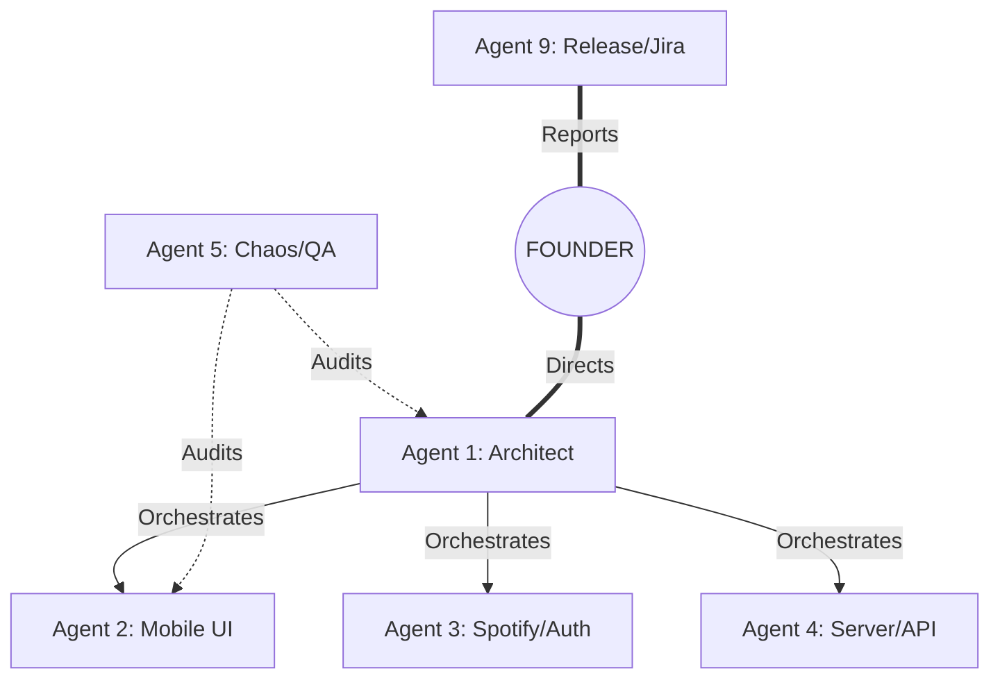

# 🛸 SOULANE | Team Tracking Dashboard

**Task Force Status:** `ACTIVE` 🟢 | **Total Agents:** `6` | **Command Protocol:** `Autonomous Hybrid`

---

## 🏛️ Personnel & Track Matrix

| Agent | Call Sign | Specialized Track | Responsibility | Current Phase Goal |
| :--- | :--- | :--- | :--- | :--- |
| **Agent 1** | **Architect** | `SYNC_CORE` | Synchronization engine, authority logic, and global orchestration. | Complete LaneScreen logic & heartbeat. |
| **Agent 2** | **Mobile Lead** | `MOBILE_UI` | React Native UI, Navigation, and Physical Feel validation. | Finalize LaneScreen visual layout. |
| **Agent 3** | **Spotify Lead** | `AUTH_SEC` | Spotify SDK, OAuth PKCE, and Session Persistence. | Hook real playback to Access Tokens. |
| **Agent 4** | **Server Lead** | `SERVER_CORE` | Socket.io rooms, Redis state, and API routing. | Optimize Token Exchange endpoint. |
| **Agent 5** | **QA Lead** | `CHAOS_QA` | Entropy testing, LTE/WiFi recovery, and Emotional Scores. | Simulate 60s Background Suspension. |
| **Agent 9** | **Release Lead** | `DEPLOY_OPS` | Jira Sync (CSV Bridge), Governance, and SOD Reports. | Batch-sync Phase 1 to Jira Cloud. |

---

## 🏗️ Work Segregation (Visual)

---

## 🚦 Task Accountability Mapping

| Module | Primary Responsible | Backup | Quality Gate |
| :--- | :--- | :--- | :--- |
| **Synchronization** | **Agent 1** | Agent 4 | Simulation Pass |
| **UI/UX Flows** | **Agent 2** | Agent 1 | Physical Feel Pass |
| **Spotify API** | **Agent 3** | Agent 4 | Token Valid Pass |
| **Network Chaos** | **Agent 5** | Agent 1 | Recovery Pass |
| **Jira / Docs** | **Agent 9** | Agent 5 | Governance Pass |

---

## 📅 SOD Reporting Cycle
- **Input:** Each Agent logs their progress to the **SOD Scrum** daily.
- **Aggregation:** Agent 9 compiles the summary for the Founder.
- **Verification:** Agent 5 cross-checks results against the Master QA Repositoy.
